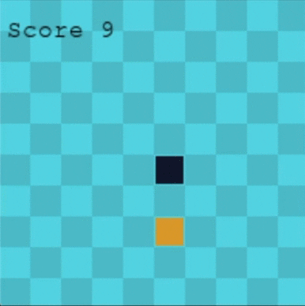

# Cobra
Reinforcement Learning Snake

<p align="center"></p>

This goal of this project was to make us learn about Deep Q-Learning Networks.

This project was made using pygame and Keras.

# Installation

You can install every requirements by doing the following command:
```
python3 -m pip install -r requirements.txt
```
Note: you may also need tensorflow

# Usage

To see Cobra in action, you first need to let it train.
Simply run:
```
python3 main.py
```
And go make yourself a coffee.
Cobra will learn from 200 games and then show you 10 games where it is at its best.

If you want to play an unusual game of Snake, simply run:
````
python3 main.py --play
````

# Authors

Alexandre Fresnais & Thibault Gaillard